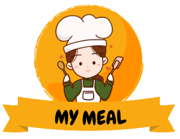

# Project KindMeal.my-Clone
Individual Project KindMeal.my

Hello everyone, this is a Readme for my construct week project that has been completed successfully within the duration of 5 days. It was really greate experience for me. Below I have described the Features of my project.

## The Journey:

The Journey so far has been challenging and fun. this was my second individual project and the deadline was just a week, it all felt like I was working on a real product, and also I tried to enact the overall activity as the real working climate where I used git commands & React project Structure. The planning and other doubt solving activities with IA were done via zoom meetings.

# Netlify Link:

## Project Details:

I got given a task to make a functional clone website of The World's 1st Meat-Free Lifestyle Platform KindMeal.my. KindMeal.my is a Malaysia startup Founded by Andy K oh in 2008, PetFinder.my has been working hard with nationwide animal shelters, rescuers, and pet lovers to improve Malaysia's animal welfare. Much of our focus was centered upon pets - specifically, dogs and cats (alright, we have rabbits, hamsters, birds, fishes, turtles-, and chickens too). The website some pages such as Login, signup, Landing-page, Meal Deals, Help, etc.
I tried my best to clone the website from scratch based on the knowledge gained till unit-4 of Journey at Masai School.

Original LOGO :
        
My LOGO :
   
 

## Tech-Stack:

    a.React (Structure)

    b.CSS (styling)

    c.HTML (Structure)

    d.Chakra UI (UI component library)

    e.Advance Javascript & ES6 (functionality)

 

Glimpse and Screenshots of our cloned website:

## 🅐 Navbar:

- This is the landing page of my website. Clicking an option on the Navbar will redirect to the respective page.

## 🅑 Home Page:

- The images on the home page are linked to all Pages. Hence clicking on it will ensure successful redirection to the next Page.

- This project have a feature like Slideshows of food Images along with Hotel Image. & can be accessable by clicking on below small previews.

- Recent Facebook posts by KindMeal.my, Yummylicious Moments, Discover Restaurants, etc.

- Content page with KindMeal.my official social media link, contacts, policies, information, account, and address.

## Footer bar:
- Here we have functions such as KindMeal.my official social media link, contacts, policies, and information. account, and address.

- KindMeal.my official social media link, contacts, policies, and information. account, and address.

## 🅒 Signup:

- Here we have a Modal Function on any page when users click on signup they get a popup on the screen with two options like FoodLover & Restaurant / Shop Owner.

## 🅓Login page:

- Here we have a Modal Function on any page when users click on Login they get a popup on the screen. If the user is registered with the website, only then he/she can log in with their respective email id & password.
   Default Email : "student@masai.com"
   Default Password : "masai@123"

## 🅔 Meal Deals:

- Users get a Button for the Next Page to get Next more Deals.

- Users get a Button for the Previous Page to get Previous Deals.

- Users can Paginate on any meals pages by clicking on numbers

## 🅕 Help:

- On the Help Section, users get multiple options for help just like advertising help, General Help, Contact Us, etc.

Technically Help is the last page developed for the best User Interface UI smooth Operations.

